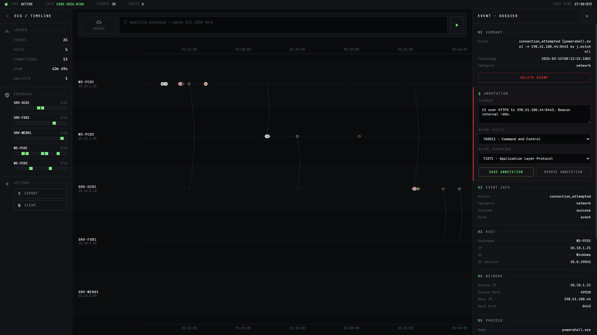

# ECS Timeline Builder
Collaborative incident timeline visualization for DFIR teams. Import ECS events from Kibana, build a shared swim-lane timeline across hosts, annotate events with MITRE ATT&CK tactics/techniques, and track per-host tactic coverage to surface investigation gaps.

Designed for simple deployment via Docker with minimal configuration and dependencies.



## Features

- **Drag-and-drop or paste** ECS JSON/NDJSON events directly from Kibana exports
- **Swim-lane timeline** grouped by host with zoom, pan, and sub-second to a multi-day scale
- **Cross-host connection arcs** link lateral movement and network flows across hosts
- **MITRE ATT&CK annotations** to tag events with tactics and techniques and add analyst comments
- **Real-time collaboration**: 2–5 analysts working simultaneously via WebSocket sync
- **Event detail panel** with organized ECS field display, raw JSON view, and inline annotation editing
- **Export** timeline with annotations as JSON for reporting and archival
- **Air-gapped deployment**: Docker image with all assets (D3.js, fonts, no CDN calls)

## Quick Start

Requires Node.js 18+

```bash
npm install
npm start
```

Open `http://localhost:12345` in a browser. To use a custom port:

```bash
PORT=8080 npm start            # Linux / macOS / Git Bash
$env:PORT=8080; npm start      # PowerShell
```

## Docker Deployment

### Build (on internet-connected machine)

```bash
docker build -t ecs-timeline-builder .
docker save ecs-timeline-builder -o ecs-timeline-builder.tar
```

Transfer `ecs-timeline-builder.tar` to the target network.

### Deploy

```bash
docker load -i ecs-timeline-builder.tar
docker run -d -p 12345:12345 -v timeline-data:/app/data --name ecs-timeline ecs-timeline-builder
```

Or with docker-compose:

```bash
docker-compose up -d
```

Team members access via `http://<host-ip>:12345`

### Data Persistence

Timeline data (events and annotations) auto-saves to `/app/data/timeline.json` inside the container. The Docker volume `timeline-data` preserves data across container restarts.

```bash
# Backup
docker cp ecs-timeline:/app/data/timeline.json ./backup.json

# Restore
docker cp ./backup.json ecs-timeline:/app/data/timeline.json
```

## Usage

1. **Import events** — Drag a `.json` or `.ndjson` file onto the drop zone, or paste JSON into the text area. Supports single objects, arrays, NDJSON, and Elasticsearch `_source` wrapper format.
2. **Explore the timeline** — Scroll to zoom, drag to pan. Events are color-coded by category (network, process, file, authentication, registry).
3. **Inspect events** — Click any event dot to open the detail panel with organized ECS fields and raw JSON.
4. **Annotate** — Add free-text comments and MITRE ATT&CK tactic/technique tags to events. Annotations sync to all connected analysts in real time.
5. **Track coverage** — The sidebar MITRE coverage panel shows which tactics have been tagged per host, highlighting investigation gaps.
6. **Export** — Download the full timeline (events and annotations) as JSON.
