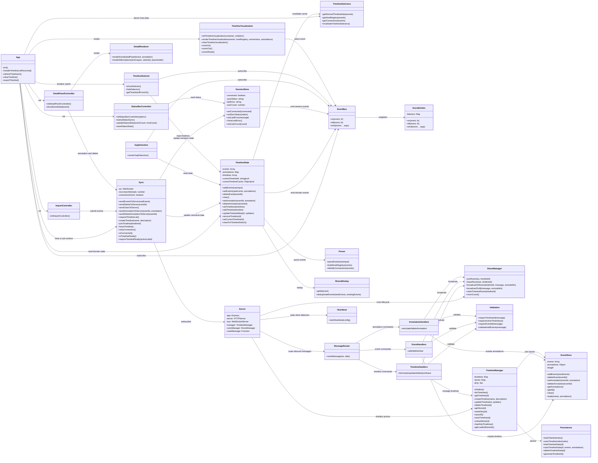
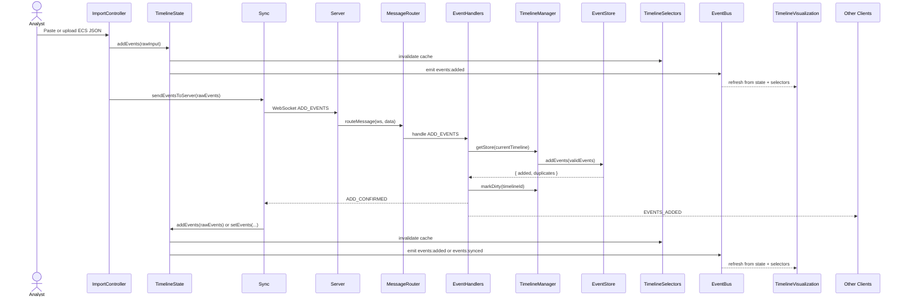

# Project UML

## Class / Component Diagram

## Sequence Diagram: Typical Event Import

## Notes

- `client/app.js` is now a bootstrap/composition module. It initializes visualization and feature controllers, subscribes to top-level state events, and owns only the remaining cross-feature rendering flow.
- `client/state.js` is the canonical timeline/domain store. It owns events, annotations, timeline metadata, and active timeline selection.
- `client/stores/session-store.js` owns connection/session state: WebSocket connectivity, sync lifecycle, user count, and last transport-visible error.
- `client/selectors/timeline-selectors.js` owns derived visualization data such as host registry and cross-host connections.
- `client/event-bus.js` remains the pub/sub backbone, with event names centralized in `client/events.js`.
- `client/sync.js` manages WebSocket lifecycle, reconnect behavior, maps server messages into timeline/session stores, and exports the `requireTimelineReady` guard used by feature controllers to gate mutations.
- `server.js` is now a composition root. Room lifecycle lives in `server/websocket/room-manager.js`, heartbeat in `server/websocket/heartbeat.js`, and protocol routing in `server/websocket/message-router.js`.
- Focused WebSocket handlers in `server/websocket/handlers/` now own timeline, event, and annotation commands.
- `server/timeline-manager.js`, `server/event-store.js`, and `server/persistence.js` still form the timeline application and persistence layers.
